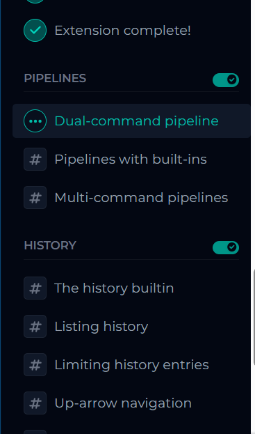
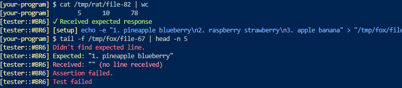

[](https://app.codecrafters.io/users/codecrafters-bot?r=2qF)

This is a starting point for Python solutions to the
["Build Your Own Shell" Challenge](https://app.codecrafters.io/courses/shell/overview).

In this challenge, you'll build your own POSIX compliant shell that's capable of
interpreting shell commands, running external programs and builtin commands like
cd, pwd, echo and more. Along the way, you'll learn about shell command parsing,
REPLs, builtin commands, and more.

**Note**: If you're viewing this repo on GitHub, head over to
[codecrafters.io](https://codecrafters.io) to try the challenge.

# Passing the first stage

The entry point for your `shell` implementation is in `app/main.py`. Study and
uncomment the relevant code, and push your changes to pass the first stage:

```sh
git commit -am "pass 1st stage" # any msg
git push origin master
```

Time to move on to the next stage!

# Stage 2 & beyond

Note: This section is for stages 2 and beyond.

1. Ensure you have `uv` installed locally
1. Run `./your_program.sh` to run your program, which is implemented in
   `app/main.py`.
1. Commit your changes and run `git push origin master` to submit your solution
   to CodeCrafters. Test output will be streamed to your terminal.


# Walkthrough & Thought-process...
Each "Build your own x" Codecrafters challenge is made of different group of tasks called extensions. 


# To implement the pipeline feature (e.g. `cat /tmp/file | wc -l`) we need to dive into the concept of forks and pipes.

Googling 'python and unix pipes', I get this [empty](https://docs.python.org/3/library/pipes.html) deprecated page pointing to newer features in [subprocess](https://docs.python.org/3/library/subprocess.html#subprocess.PIPE) module. 

> subprocess.PIPE  
Special value that can be used as the stdin, stdout or stderr argument to Popen and indicates that a pipe to the standard stream should be opened. Most useful with Popen.communicate().

Meaning there are two things we can utilize to implement pipe: `Popen` object constructor and notably `Popen.communicate` method. There are more [methods available ](https://docs.python.org/3/library/subprocess.html#popen-objects).

Popen.communicate(input, timeout) This object method looked very important.
> Interact with process: Send data to stdin. Read data from stdout and stderr, until end-of-file is reached.


```
   import subprocess as s
	cmd = "cat /tmp/file | wc -l"
	pipelist = cmd.split("|")
	p1 = s.Popen(shlex.split(pipelist[0]), stdout=s.PIPE)
	p2 = s.Popen(shlex.split(pipelist[1]), stdin=s.PIPE)
   p2.communicate(p1.stdout.read())....

```
subprocess.run uses Popen underneath. Popen's stout is a io.BufferredRead! so need to use `p1.stdout.read()`. This arrangement works for normal chain commands such as `cat //tmp/ant/file-4 | wc -l` but the following codecrafter test case fails: `tail -f /tmp/owl/file-33 | head -n 5`. Tail with -f flag will not quit on its own and will show newly appended data(that has been appeneded while this command was running!) from the file.
We can pass keyboard stroke ctrl+c also known as signal.SIGINT with this line: `p1.send_signal(signal.SIGINT)` after 1,2 or 3 seconds...
But its not enough to pass the codecrafters test case which will append new data mid-execution. If we use write the code like this:
```

p1 = subprocess.Popen([beforepipe.split()[0], *beforepipe.split()[1:]], stdout=subprocess.PIPE)
p2 = subprocess.Popen([afterpipe.split()[0], *afterpipe.split()[1:]], stdin=subprocess.PIPE)
	try:
		p1.wait(timeout=3)
	except Exception as TimeoutExpired:
		p1.send_signal(signal.SIGINT)
	except:
		sys.stdout.write("command not found, inside runpipe\n")

   p2.communicate(p1.stdout.read()) # this is actually a 'blocking' code, its blocks everything including the debugger! read() seraching for EOF that tail -f is waiting for the user the provide...
```
We get this error:  


If we dont wait() and exit the p1 command(tail) won't 'catch' the new appended line(that has been appeneded while this command was running.)
After staring at the docs and the wall (and chatgpt), it seems i made the two Popen wrong. I tried to play basketball with two pipes, when i can just 'stitch' them together. `p1.stdout` should be the` stdin` of p2. p1 is tail command and p2 is the head command reading from tail. Now it makes more sense.
```
	p1 = subprocess.Popen([beforepipe.split()[0], *beforepipe.split()[1:]], stdout=subprocess.PIPE)
	p2 = subprocess.Popen([afterpipe.split()[0], *afterpipe.split()[1:]], stdin=p1.stdout)

```

But we still have to figure the waiting and terminating p1 command(`tail`). We can definitely close p1(tail) after p2(head) has finished running as `head -n 5` is supposed to stop and exit after reading 5 lines. Hence: `p2.wait(); p1.terminate()`.

```
	p1.stdout.close() 
   # This close() is general good practise. not particularly relevant to pass the codecrafter test case.
   # The p1.stdout.close() call after starting the p2 is important in order for p1 to receive a SIGPIPE if p2 exits before p1. SIGPIPE is a synchronous signal that’s sent to a process (thread in POSIX.1-2004) which attempts to write data to a socket or pipe that has been closed by the reading end.
   # Hence, after p2(head command) is done printing all lines(`head -n 5), then if p1 attempts to write more, then p1 get SIGPIPE-ed. Though this scenario may or may not happen.
	
   p2.wait()
   # This crucial waiting simply blocks still until p2 exits. If we provide a `timeout=5` argument, then it will throw an exception error (https://alexandra-zaharia.github.io/posts/kill-subprocess-and-its-children-on-timeout-python/#:~:text=The%20timeout%20needs%20to%20be%20specified%20in%20Popen.wait()).

	p1.terminate()
   # Now we can safely quit from the tail command.

	p1.wait()
   # optional cleanup.
```

And this is the final code snippet to pass `Dual-command pipeline #br6`

```
def runpipes(beforepipe,afterpipe):

	import signal
	p1 = subprocess.Popen([beforepipe.split()[0], *beforepipe.split()[1:]], stdout=subprocess.PIPE)
	p2 = subprocess.Popen([afterpipe.split()[0], *afterpipe.split()[1:]], stdin=p1.stdout)

	p1.stdout.close()
	p2.wait()
	p1.terminate()
	p1.wait()

```
